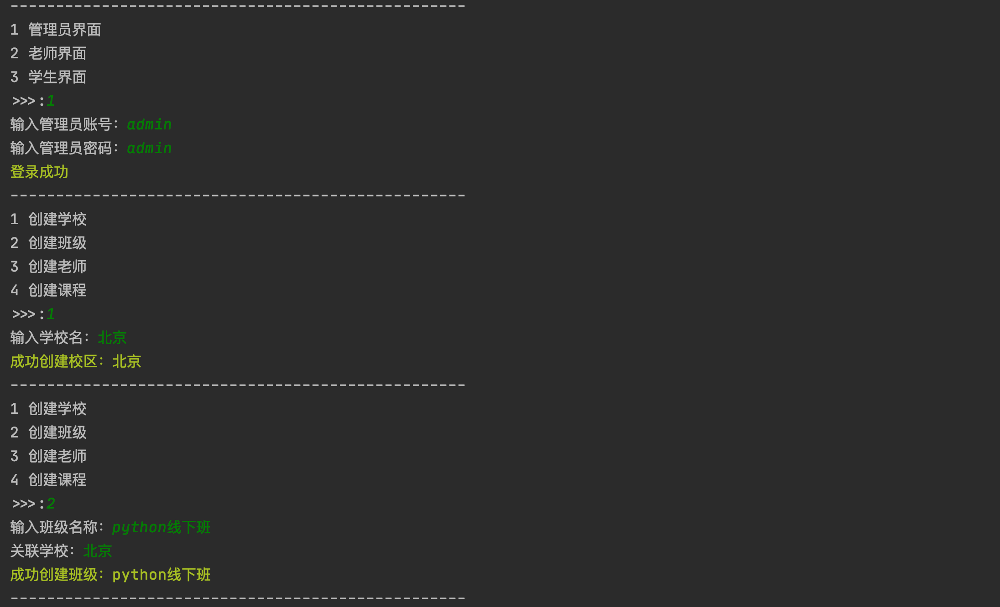
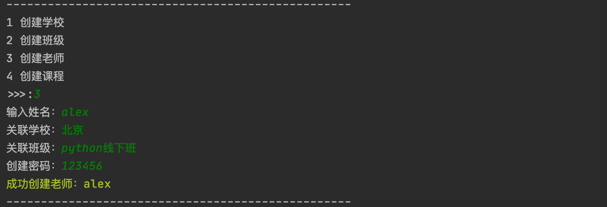
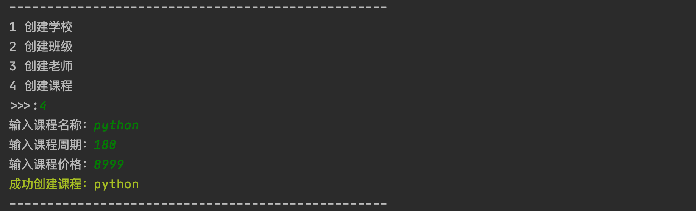
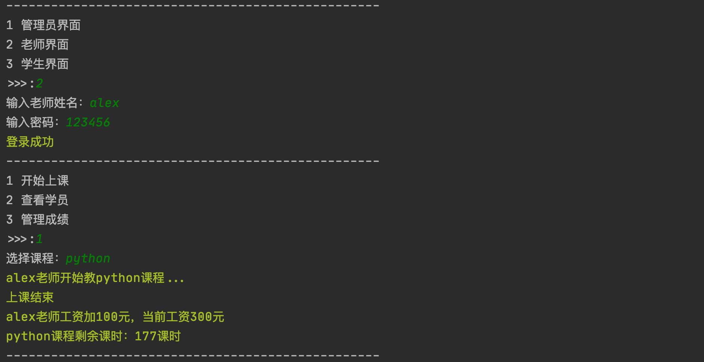
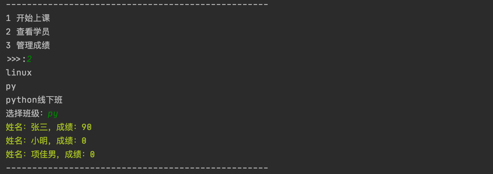
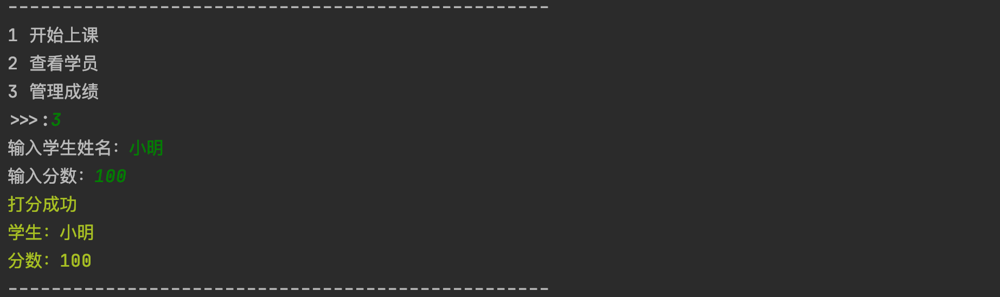
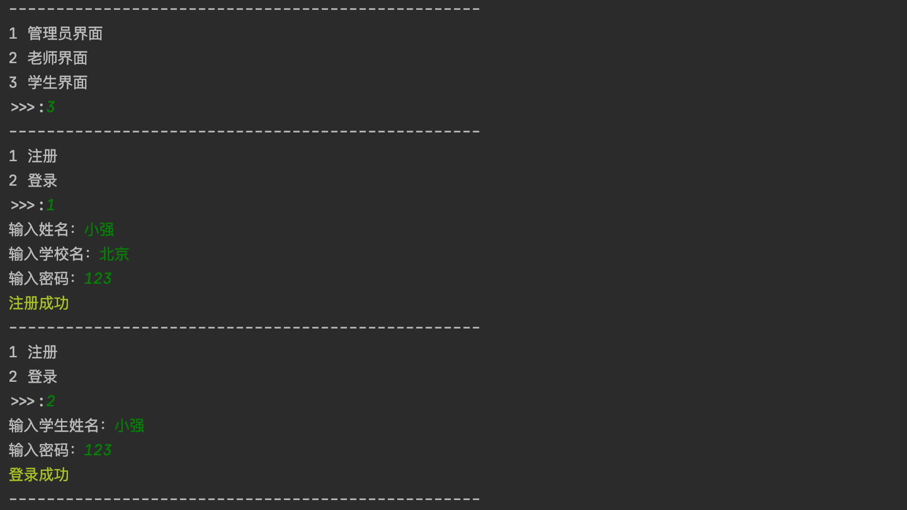
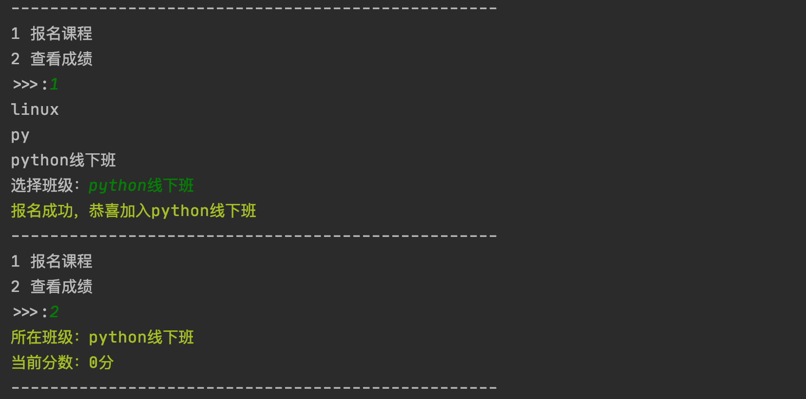

## Python练习-选课系统

### 1.[功能描述]
1. 程序提供三个角色接口
    1. 管理员视图
        * 创建学校
        * 创建班级
        * 创建老师
        * 创建课程
    2. 讲师视图
        * 选择班级上课
        * 查看班级学员列表
        * 修改所管理的学员的成绩
    3. 学员视图
        * 注册
        * 登录
        * 选课
        * 查看成绩
2. 输入数字编号进入对应视图，输入'Q'或'q'退回上一级视图

### 2.[开发环境]
1. 操作系统：macOS
2. 解释器版本：python3.9
3. IDE：Pycharm

### 3.[项目结构简介]
1. bin
    * run.py
        > 程序运行函数
2. conf
    * setting.py
        > 配置文件
3. core
    * main.py
        > 逻辑主函数
    * admin.py
        > 管理员界面
    * teacher.py
        > 老师界面
    * student.py
        > 学生界面
4. db
    * school
        > pickle序列化学校对象的存储位置
    * class
        > pickle序列化班级对象的存储位置
    * lesson
        > pickle序列化课程对象的存储位置
    * teacher
        > pickle序列化老师对象的存储位置
    * student
        > pickle序列化学生对象的存储位置

### 4.[启动方式]
1. IDE：进入工程bin目录，直接运行run.py文件
2. 终端：进入工程bin目录，python3 run.py

### 5.[登录信息]
1. 管理员
    * 账号：admin
    * 密码：admin
2. 老师
    * 账号：alex
    * 密码：123456
3. 学生
    * 账号：小强
    * 密码：123

### 6.[运行效果]
1. 管理员界面

2. 老师界面

3. 学生界面

