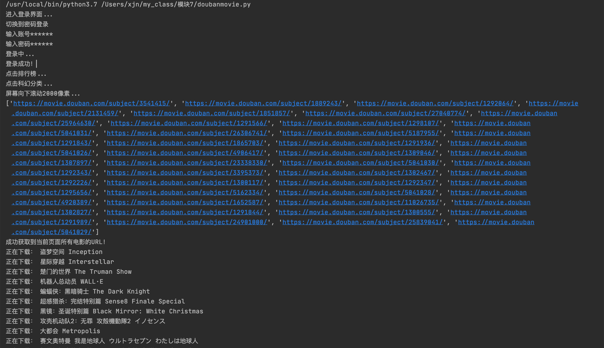
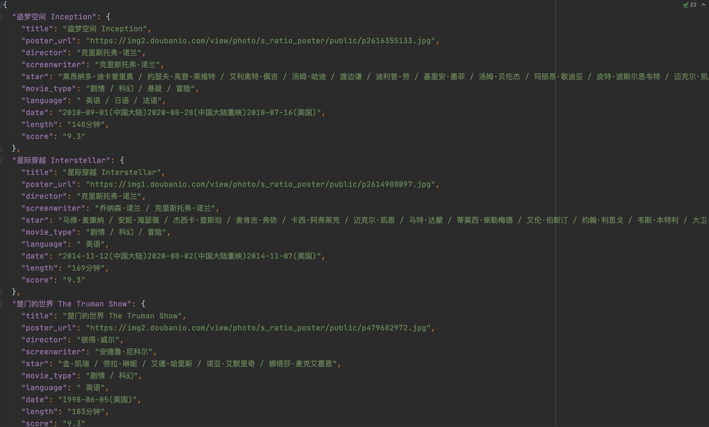

## Python练习-豆瓣电影信息爬虫

### 1.[功能描述]
1. 使用任意代理IP进行如下操作
2. 使用requests模块进行豆瓣电影的个人用户登录操作
3. 使用requests模块访问个人用户的电影排行榜->分类排行榜->任意分类对应的子页面
4. 爬取需求3对应页面的电影详情数据
5. 爬取3对应页面中滚动条向下拉动2000像素后加载出所有电影详情数据，存储到本地json文件中或者相应数据库中

### 2.[开发环境]
1. 操作系统：macOS10.15.7
2. 解释器版本：python3.7.9

### 3.[搭配工具]
1. 第三方模块
    * selenium
2. 浏览器驱动
    * 下载谷歌浏览器驱动：http://chromedriver.storage.googleapis.com/index.html

### 4.[启动方式]
1. 配置文件
    * 进入`settings.py`，配置登录信息、浏览器驱动、代理IP
```python
# 豆瓣账号、密码
USERNAME = '******'
PASSWORD = '******'

# 浏览器驱动路径：访问 http://chromedriver.storage.googleapis.com/index.html 下载浏览器驱动，存储到项目根目录下
BROWSER_PATH = './chromedriver'

# 代理IP：访问 http://www.goubanjia.com 获取临时代理IP
PROXY_FLAG = True
PROXY_HTTPS = [
    {"https": "110.228.45.103:8118"},
]
```
2. 启动项目
    * 方式一：pycharm直接运行
    * 方式二：终端进入项目根目录，运行`python3 moviespider.py`
### 5.[运行效果]
1. 运行过程

2. json数据



