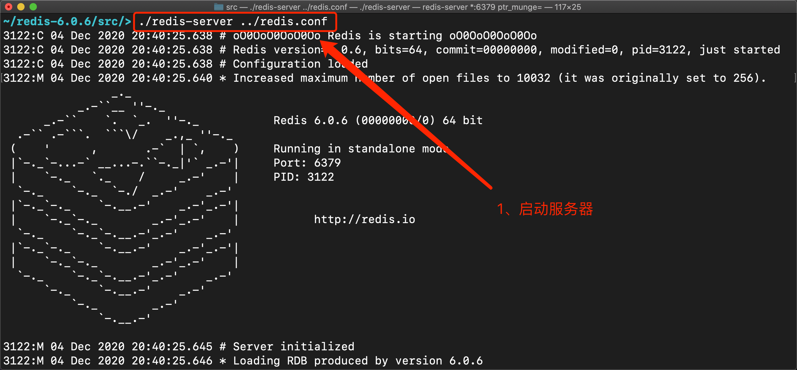
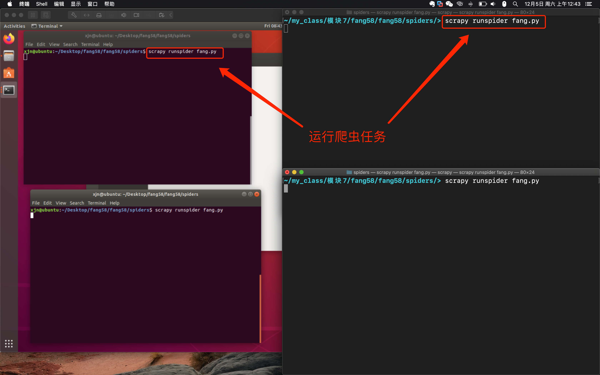
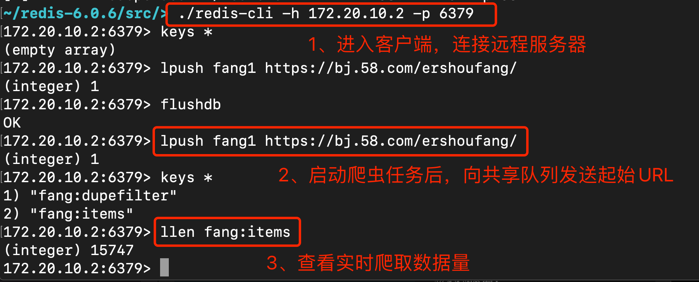
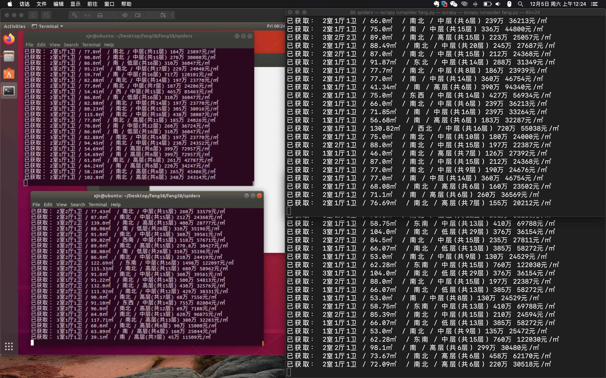

## Python练习-二手房信息分布式爬虫

### 1.[功能描述]
1. 基于CrawlSpider进行二手房信息的爬取
2. 本机搭建分布式环境对二手房信息进行爬取
3. 搭建多台机器的分布式环境，多台机器同时进行二手房数据爬取

### 2.[开发环境]
1. 操作系统：macOS10.15.7｜ubuntu-18.04.5
2. 解释器版本：python3.7.9｜python3.6.9
3. 爬虫框架：scrapy

### 3.[项目结构简介]
1. spiders
    * 爬虫文件
2. items.py
    * items数据
3. middlewares.py
    * 中间件
4. settings.py
    * 配置文件
5. README

### 4.[启动方式]
1. 基础配置
* redis服务器：`redis.conf`
```python
# a. 将默认绑定本机IP的选项注释
# bind 127.0.0.1

# b. 关闭保护模式
protected-mode no
```
* 项目：`settings.py`
```python
# redis数据库：修改REDIS_HOST为远程数据库IP
REDIS_HOST = '127.0.0.1'
REDIS_PORT = 6379
```
2. 启动服务器：进入redis服务器的src目录，运行`./redis-server ../redis.conf`

3. 分布式搭建：将项目拷贝到不同主机环境（python版本在3.8以下）
4. 准备爬虫：在不同的主机上，终端进入项目的spiders目录，运行`scrapy runspider fang.py`

5. 开始爬虫：
* 启动任意redis客户端`./redis-cli -h '服务器IP' -p '服务器端口'`
* 向共享队列发送起始URL：`lpush fang1 https://bj.58.com/ershoufang/`




