## Python练习-FTP文件系统

### 1.[功能描述]
1. 服务器
    * 支持多用户同时在线
    * 并发处理用户发来的请求指令
2. 客户端
    * 用户注册、登录（注册时设置磁盘空间大小）
    * 访问家目录，随意切换家目录下的任何目录
    * 创建、删除目录
    * 下载、上传文件（md5校验）
    * 删除文件

### 2.[开发环境]
1. 操作系统：macOS
2. 解释器版本：python3.9
3. IDE：Pycharm

### 3.[项目结构简介]
1. bin
    * sever.py
        > 服务器入口
    * client.py
        > 客户端入口
2. conf
    * setting.py
        > 用户可以配置最大并发数，默认并发用户为10
        > 用户可以配置端口号，默认8080
3. core
    * tools.py
        > 自定义文件处理功能
        > 自定义md5功能
4. db
    * client
        > 存储所有用户的家目录
    * client_usr
        > 存储所有pickle序列化的用户对象
5. README.md
    > 用户帮助文档
6. 流程图

### 4.[启动方式]
1. IDE：进入工程bin目录，先运行sever.py文件，再运行client.py文件
2. 终端：打开终端运行sever.py文件，新建终端再运行client.py文件

### 5.[登录信息]
1. 用户登录信息
    * 账号：alex
        > 密码：123456
    * 账号：小明
        > 密码：123
2. 自定义创建用户

### 6.[指令集]
1. 创建目录
    * mkdir 目录名
2. 删除目录
    * rmdir 目录名
3. 切换目录
    * cd 目录
    * cd ..
    * cd /
4. 遍历目录
    * ls
5. 上传文件
    * put 本地文件绝对路径
6. 下载文件
    * get 文件名（带后缀）
        > 输入指令，回车后，再输入文件下载到本地的绝对路径
7. 删除文件
    * remove 文件名
8. 退出客户端
    * exit

### 7.[运行效果]
1. 客户端界面
    * 注册与登录
        > 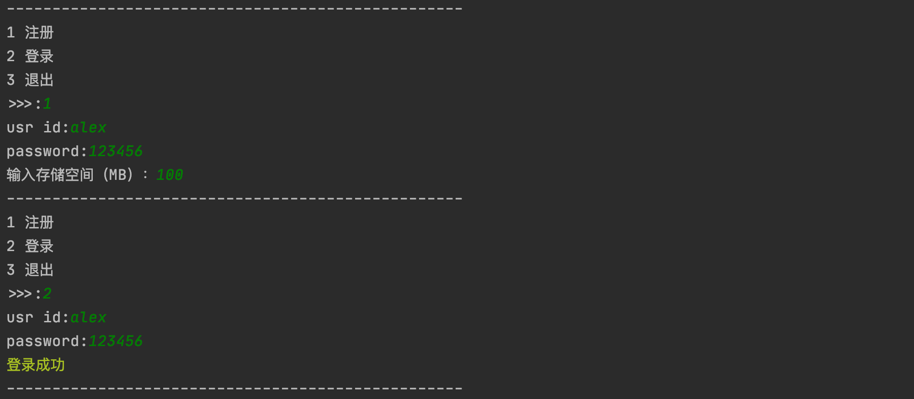
    * 多用户登录
        > 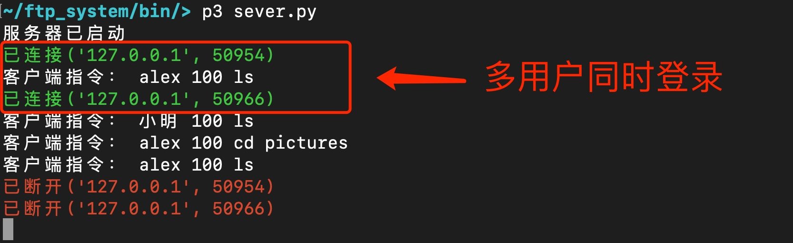
    * 创建、删除及浏览目录
        > 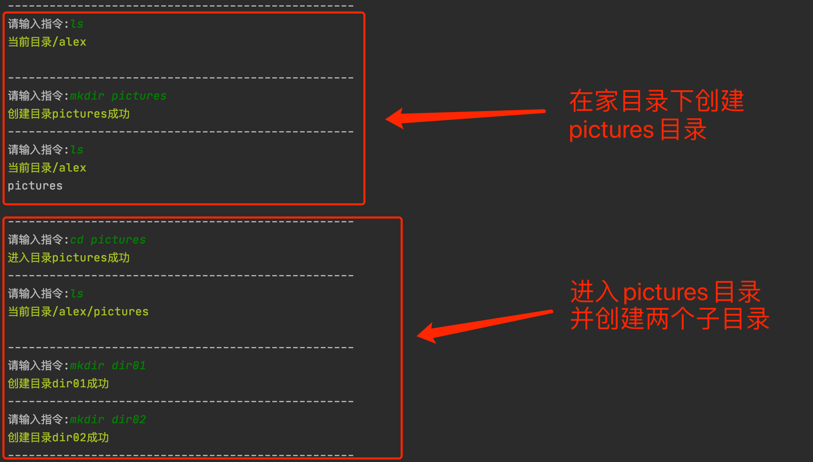
        > 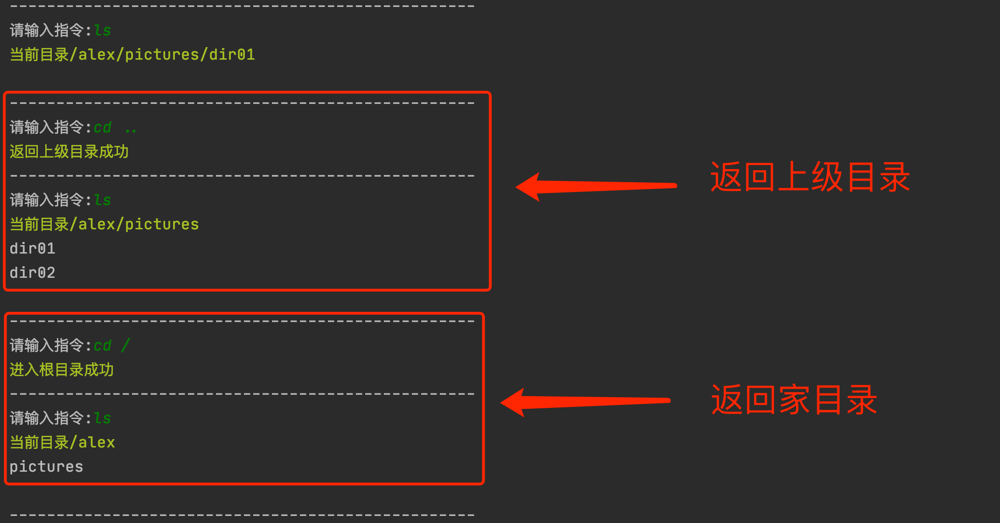
        > 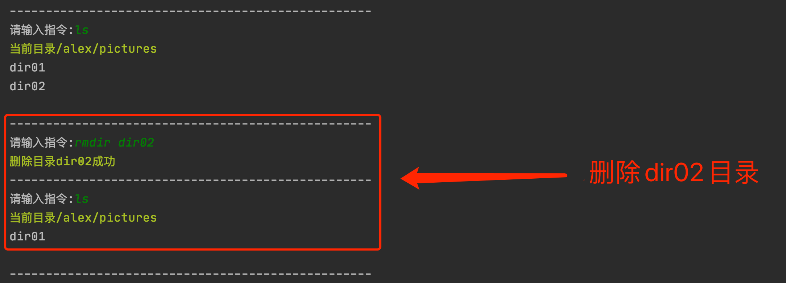
    * 上传文件
        > 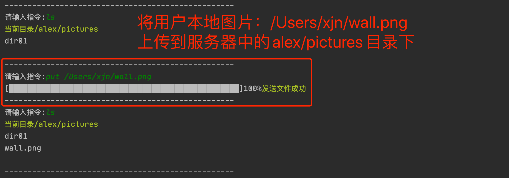
    * 下载文件
        > 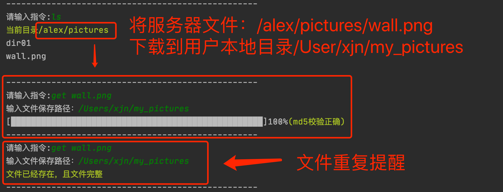
        > 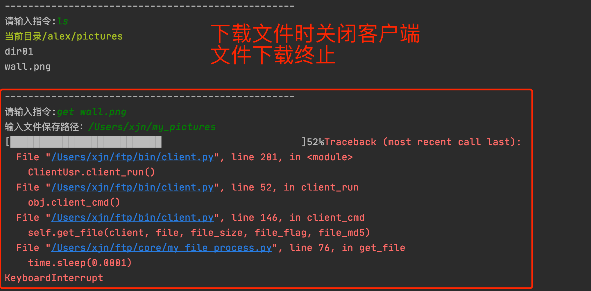
        > 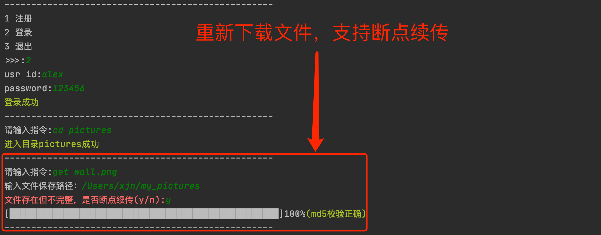
    * 删除文件
        > 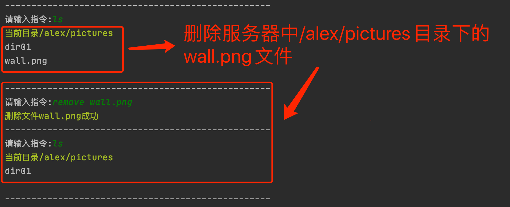
2. 服务器界面
    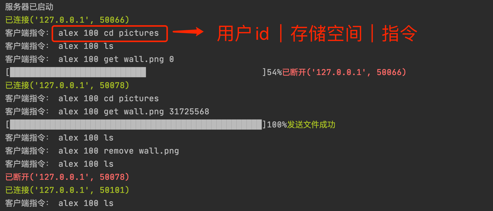
    
