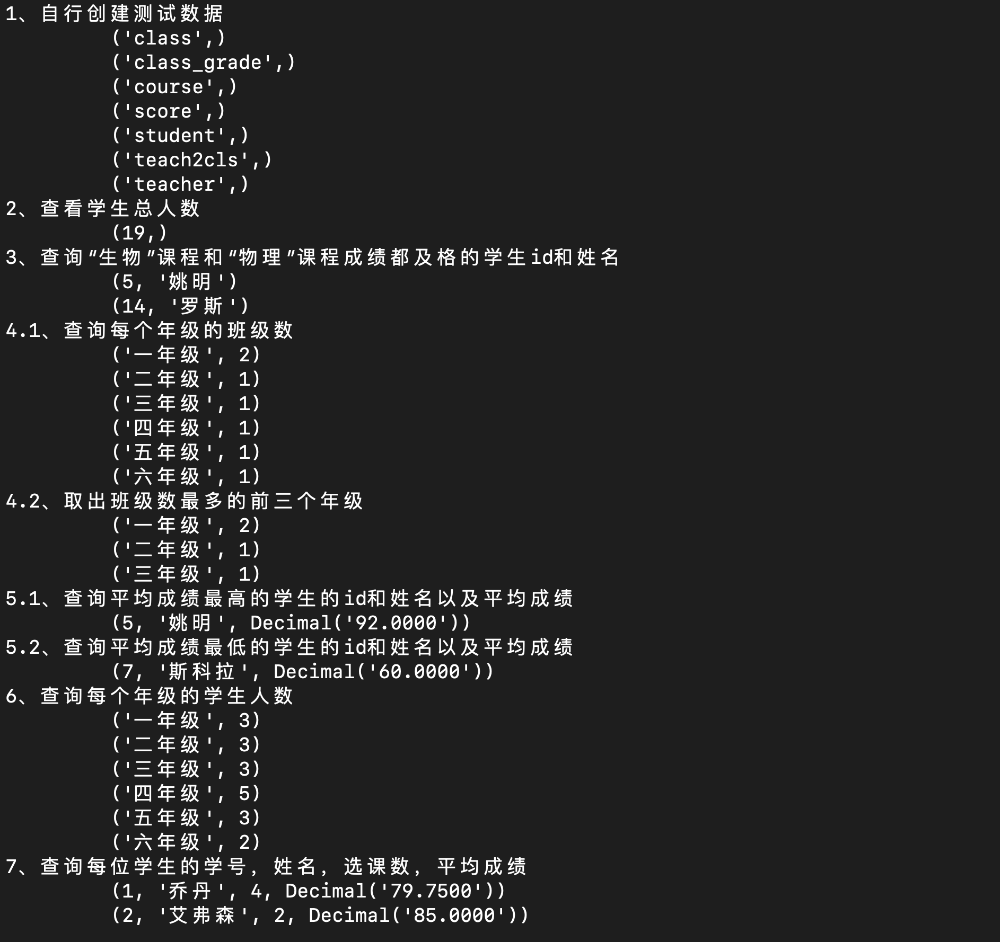
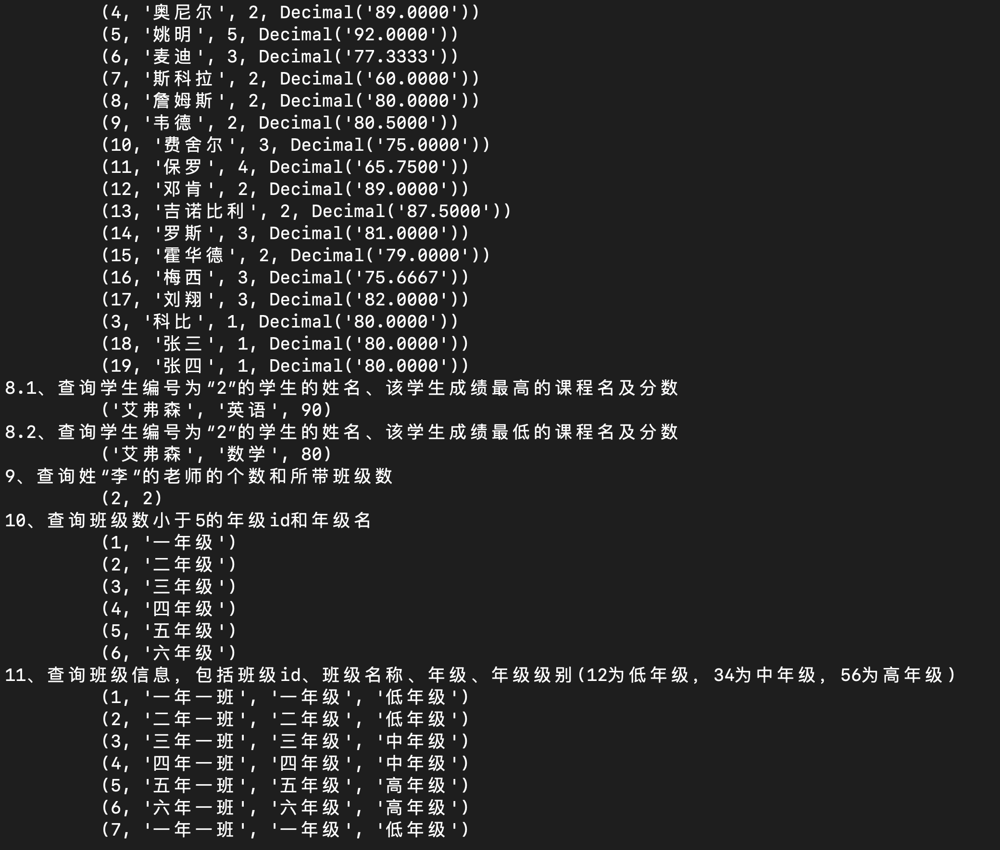
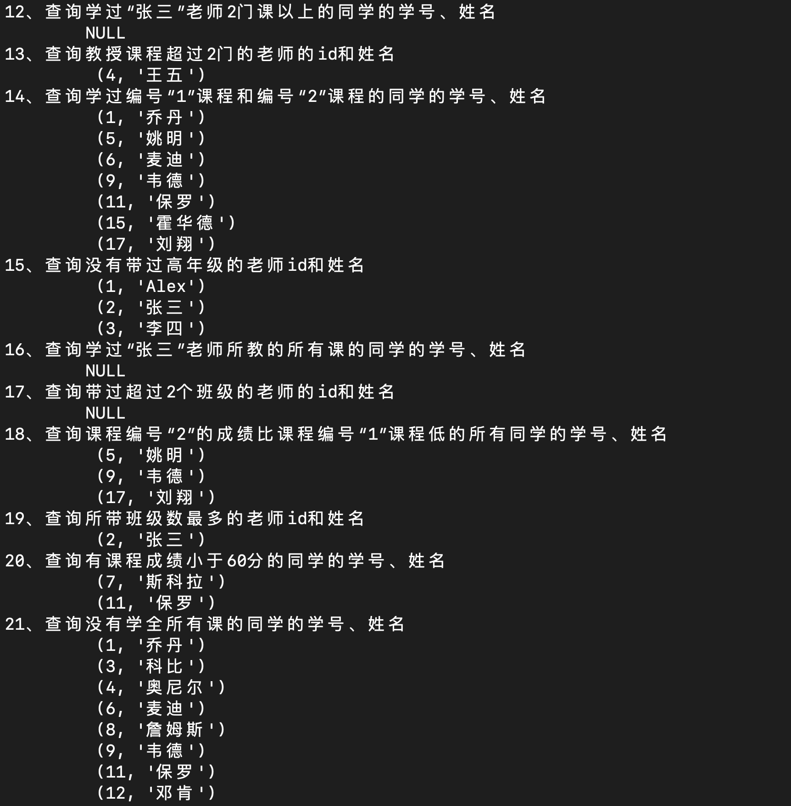
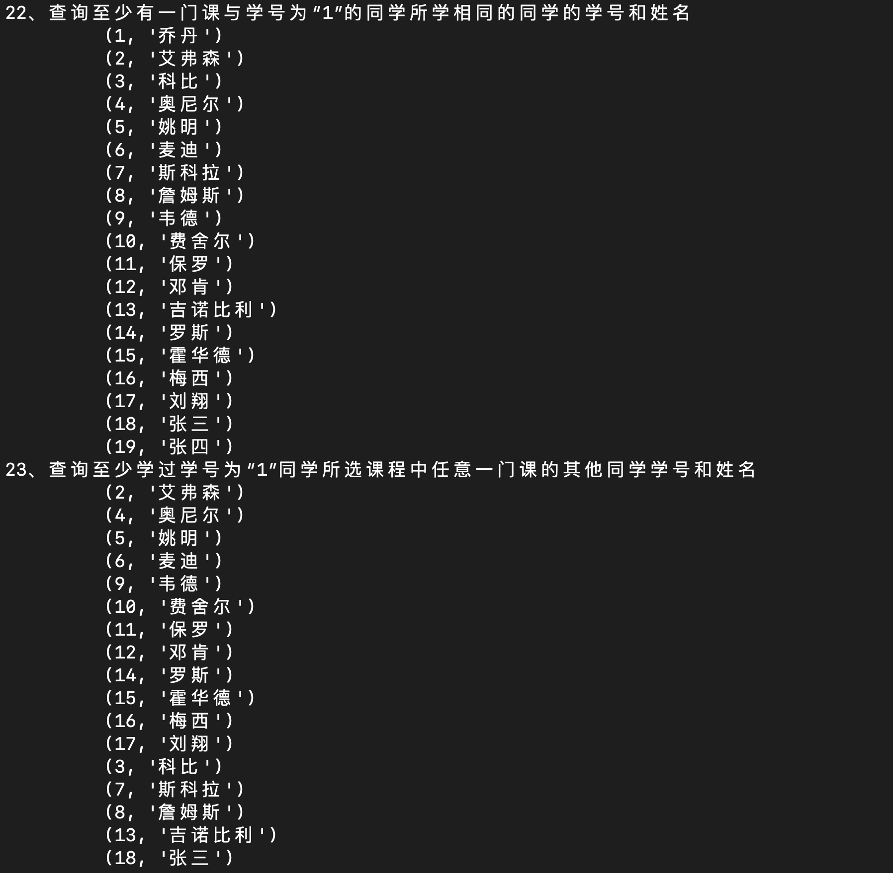
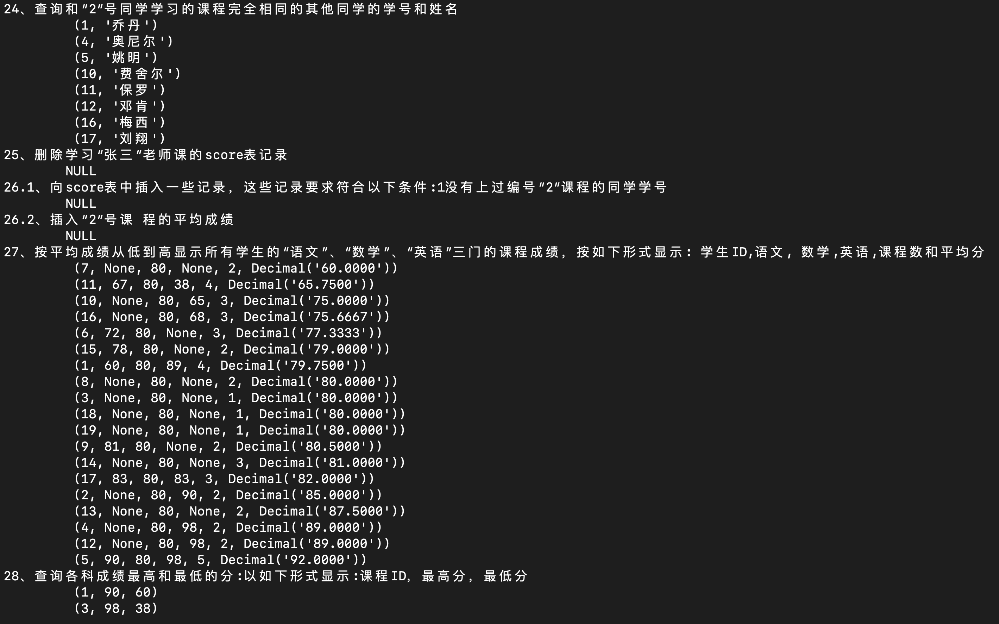
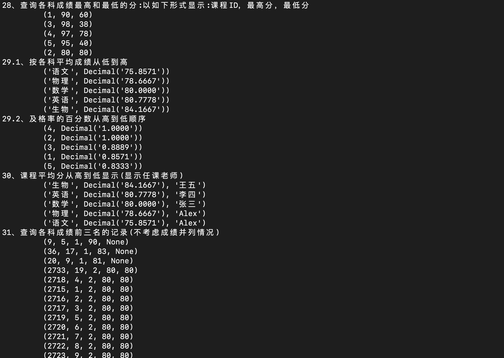
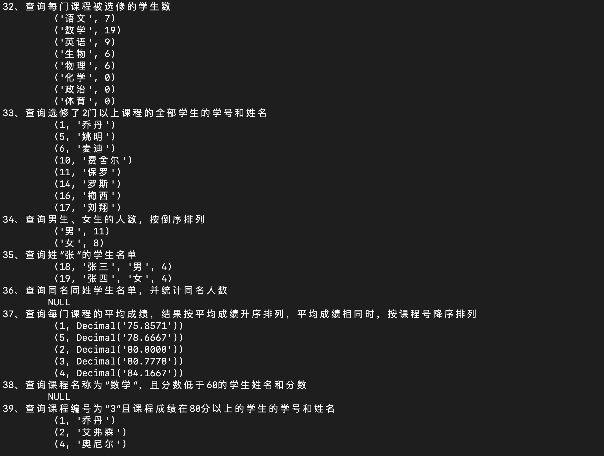
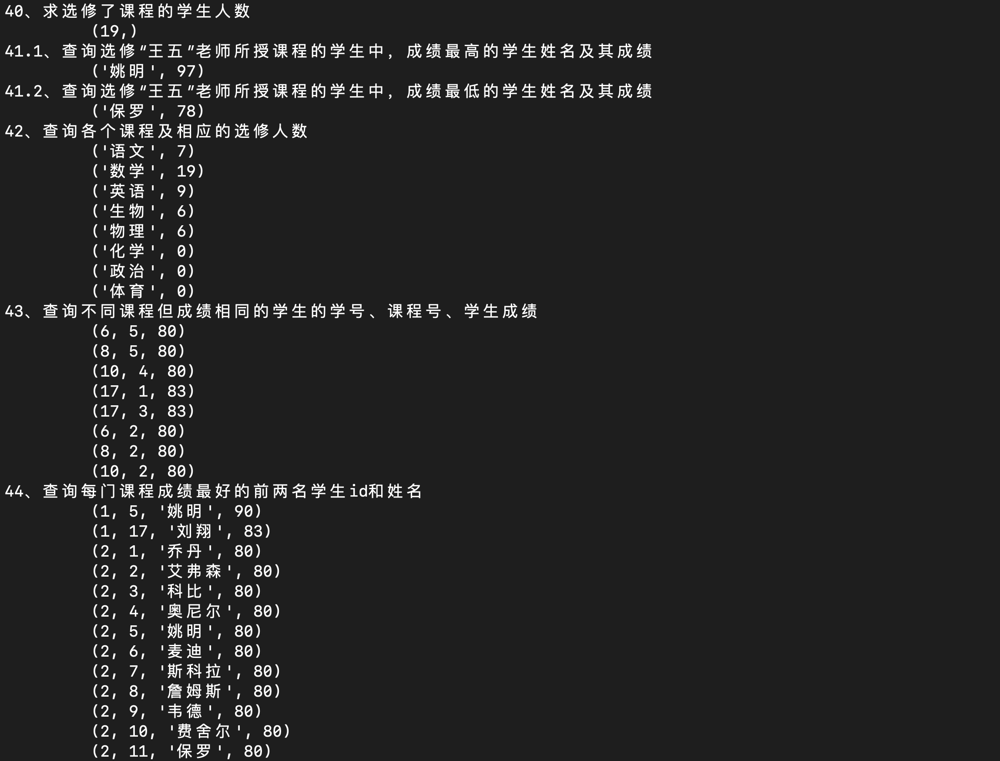
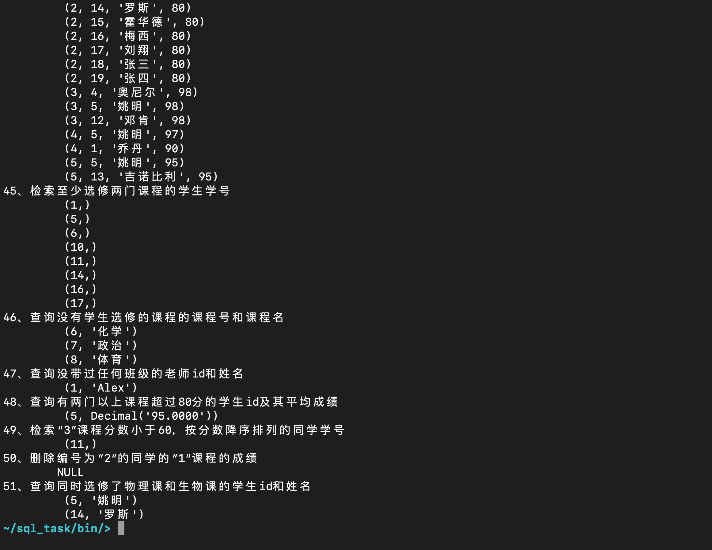

## Python练习-pymysql指令练习

### 1.[功能描述]
1. 连接远程数据库（个人电脑）
2. 自定义MySQL指令，对远程数据库执行操作

### 2.[开发环境]
1. 操作系统：macOS
2. 解释器版本：python3.9
3. IDE：Pycharm

### 3.[项目结构简介]
1. bin
    * run.py
        > 程序入口
2. conf
    * setting.py
        > 配置数据库连接参数
        > 编辑MySQL指令
3. core
    * mysql.py
        > 执行MySQL指令
4. README.md
    > 用户帮助文档

### 4.[启动方式]
0. 启动前先设置MySQL登录信息
    * 修改`conf/setting.py`数据库参数
1. IDE：进入工程bin目录，运行run.py
2. 终端：进入工程bin目录，执行`python3 run.py`

### 6.[运行效果]

